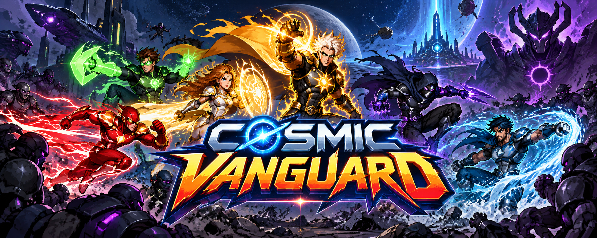

# Cosmic Vanguard



Beat 'em up 2D / 2.5D para navegador, com mapa de operações, recrutamento de personagens e troca de herói durante a luta.

## Versões nativas

Há um port C++/SDL2 para Windows, Linux, Nintendo Switch, PS Vita e PSP em
[`native/README.md`](native/README.md). Os pacotes locais ficam em
`native/dist/v0.1.2/` após executar `./native/tools/build-all.ps1` no PowerShell.
É uma primeira versão jogável; consulte o README nativo para diferenças em
relação ao jogo web e estado da validação dos consoles.

## Sprites aplicados

O jogo agora usa os sprite sheets gerados para os 6 heróis. Cada personagem possui no gameplay as sete famílias de animação presentes nos sheets:

- **Idle**
- **Walk**
- **Attack / Combo**
- **Jump / Takeoff**
- **Mobility** — voo, glide, aerial lunge, speed dash, water rush ou hard-light flight
- **Hit Reaction**
- **Special Attack**

Os sheets originais ficam em `assets/sprites/`. Para evitar textos, bordas e partes de frames vizinhos durante o jogo, foram gerados atlases processados em `assets/sprites/processed/`. São esses atlases que o `game.js` renderiza.

## Heróis e golpes

- **Solarion** — combo solar, salto/takeoff, voo solar e **Solar Burst**.
- **Night Talon** — baton combo, grapple leap, glide/dash e **Shadow Onslaught**.
- **Valoria** — spear combo, battle leap, aerial lunge e **Aegis Storm**.
- **Red Velocity** — speed strike combo, burst start, speed dash e **Kinetic Surge**.
- **Abyss King** — trident combo, wave leap, water rush e **Tidal Breaker**.
- **Emerald Nova** — construct combo, ascend, hard-light flight e **Nova Barrage**.

Os movimentos especiais não são apenas animações: eles possuem dano, alcance, invulnerabilidade, projéteis ou múltiplos impactos próprios de acordo com o personagem.

## Progressão

- 4 setores de campanha.
- 3 heróis disponíveis no início: Solarion, Night Talon e Valoria.
- Red Velocity, Abyss King e Emerald Nova são recrutados nos setores externos.
- Troca de personagem em tempo real.
- Inimigos corpo a corpo, atiradores, brutamontes, elite e chefes.
- Créditos, pontuação, recorde e 3 dificuldades.
- 3 slots de save usando `localStorage`.
- Saves da versão anterior são migrados para os novos IDs de personagens.

## Controles

No mapa, pressione **M** para alternar entre **1 jogador** e **2 jogadores** antes de iniciar a missão. No cooperativo local, cada jogador controla um herói diferente no mesmo teclado. A missão continua enquanto ao menos um herói estiver vivo.

**Modo solo**

- **WASD / Setas** — mover
- **J / Z** — executar o combo completo do sprite sheet
- **K / X** — especial do personagem
- **L / C** — movimento característico do personagem
- **Espaço** — pular
- **Q / E** — trocar herói durante a fase
- **Esc / P** — pausa
- **R** — tela de equipe no mapa
- **H** — abrir leitor da HQ oficial (Cosmic Vanguard #1)

**Modo 2 jogadores**

| Ação | Jogador 1 | Jogador 2 |
| --- | --- | --- |
| Mover | WASD | Setas |
| Atacar | F | J |
| Especial | G | K |
| Movimento especial | H | L |
| Pular | Espaço | Shift direito |
| Trocar herói | Q / E | U / O |

**Esc / P** pausa para ambos.

## Quadrinhos e Lore (HQs)

O jogo inclui um leitor de quadrinhos integrado acessível a qualquer momento pelo botão no canto da tela (**📖 LER HQs**) ou pressionando a tecla **H**.

- **Edição #1**: *Cosmic Vanguard #1 — A Fronteira Foi Encontrada* (16 páginas em arte colorida).
- Leitor com suporte a página única e página dupla (spread), barra de miniaturas, navegação por teclado (← / → / Espaço / Esc), zoom, tela cheia, gestos touch e link para download/abertura do PDF original em hqs/.
- Ao abrir o leitor durante uma missão, o combate é pausado automaticamente.

## Sprite Sheet Viewer

Abra `sprite-viewer.html`. O viewer agora carrega exatamente os atlases processados usados pelo jogo.

Na aba **Cenários**, escolha um dos quatro fundos da campanha para inspecioná-lo em 960 × 540. A aba **Combate** permite trocar o cenário durante a prévia com herói e inimigo. Os fundos também são usados nas respectivas fases do jogo.

Há seleção direta para:

- Idle
- Walk
- Attack / Combo
- Jump / Takeoff
- Mobility / Dash / Flight
- Hit Reaction
- Special Attack

Os atlases de gameplay usam células de **320 × 240 px**, o que torna simples revisar frame por frame e ajustar cortes.

## Suporte PWA e Jogo Offline

O jogo é uma **Progressive Web App (PWA)** completa com funcionamento offline total:

- **Instalação no dispositivo**: Pode ser instalado no desktop ou celular pelo botão **⬇ Instalar** no topo da tela ou pelo menu do navegador.
- **Cache Offline Inteligente**: O Service Worker (sw.js) pré-armazena em cache todos os 77 arquivos do jogo (códigos, heróis, inimigos, projéteis, cenários e todas as 16 páginas da HQ).
- **100% Jogável Sem Internet**: Após a primeira visita, o jogo abre e roda perfeitamente mesmo sem conexão ou em modo avião.

## Rodar

O projeto é estático. Você pode abrir `index.html` diretamente, mas um servidor local evita restrições de alguns navegadores:

```bash
python -m http.server 8000
```

Depois abra `http://localhost:8000`.

## Estrutura

- `index.html` — página do jogo e controles touch
- `style.css` — layout e interface
- `game.js` — engine, combate, animações, mapa, IA e saves
- `sprite-viewer.html` — ferramenta de inspeção de frames
- `assets/sprites/` — sheets originais
- `assets/sprites/processed/` — atlases usados pelo gameplay
- `assets/sprites/scenarios/` — fundos de Neon Harbor, Iron District, Skyspire e Void Gate


## Atualização: sprites de inimigos e boss
- Shadow Trooper, Pulse Gunner, Armored Brute, Rift Assassin e Void Tyrant agora foram aplicados no gameplay.
- Cada inimigo usa animações de idle, walk, attack, jump/leap, hurt e special conforme o sprite sheet.
- O sprite-viewer também lista os sheets dos inimigos para facilitar testes de corte.
